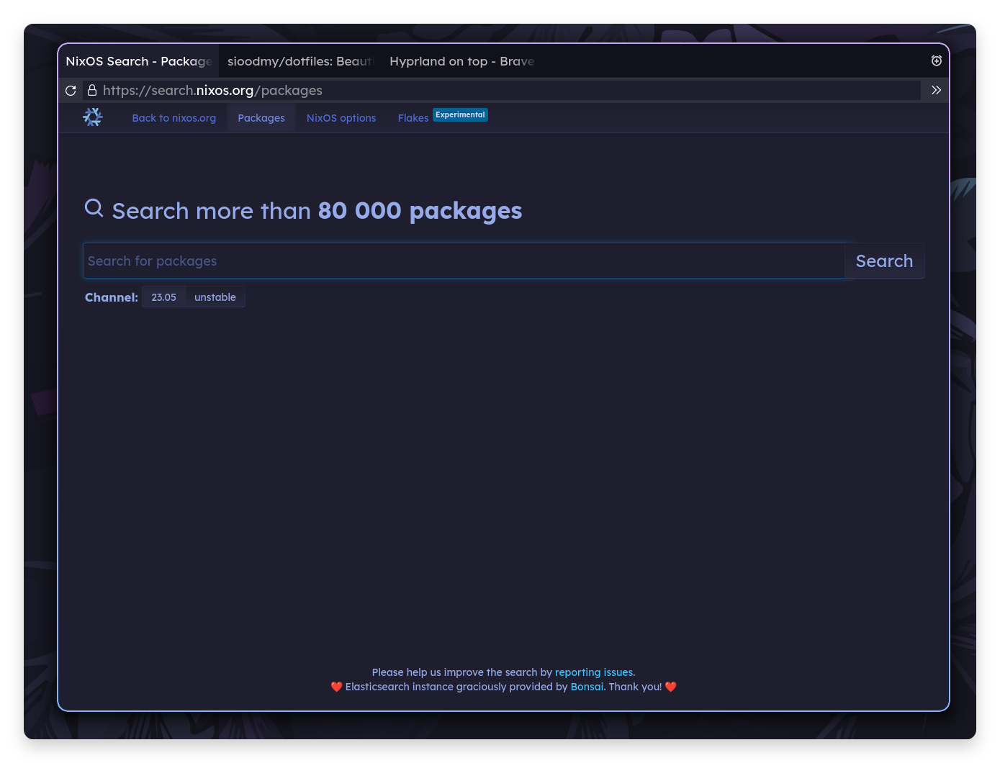
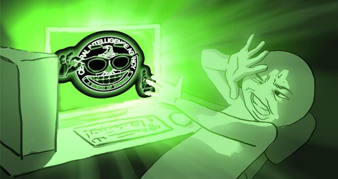

# 🥑 Schizofox
*our goal is to get on the CIA watchlist*

<p align="center">
  
  
</p>

## About
Hey, so this configuration started as a part of my [dotfiles repo](https://github.com/sioodmy/dotfiles), but apparently people actually used it, so I decided to move it into its own flake.
Compared to other browsers/configuration I would say its pretty schizophrenic, but I use it as my daily driver, so I had to keep some sane defaults (if you really need to, just use Tor Browser).
Keep in mind that any "super ultra privacy friendly firefox config" will make you stick out and won't protect you from fingerprinting, sadly there is no escape from that.

Another cool thing is declarative theming. Just specify 3 colors and your font of choice and nix will do the rest (userChrome.css and darkreader config). 

Make sure to submit an issue in case anything brakes (or contribute if you know how to fix it)

funfact: clearing cookies is just a waste of time with cookie isolation enabled (just use temporary containers if you need to)
## 💛 Donate

If you would like to support me you can sponsor me via ko-fi

<a href="https://ko-fi.com/sioodmy"> </a>

## Configuration
```nix
programs.schizofox = {
  enable = true;

  theme = {
    background-darker = "181825";
    background = "1e1e2e";
    foreground = "cdd6f4";
    font = "Lexend";
    extraCss = ''
      body {
        color: red !important;
      }
    '';
  };

  search = {
    defaultSearchEngine = "Brave";
    removeEngines = ["Google" "Bing" "Amazon.com" "eBay" "Twitter" "Wikipedia"];
    searxUrl = "https://searx.be";
    searxQuery = "https://searx.be/search?q={searchTerms}&categories=general";
    addEngines = [
      {
        Name = "Etherscan";
        Description = "Checking balances";
        Alias = "!eth";
        Method = "GET";
        URLTemplate = "https://etherscan.io/search?f=0&q={searchTerms}";
      }
    ];
  };
  
  security = {
    sanitizeOnShutdown = false;
    userAgent = "Mozilla/5.0 (Windows NT 10.0; Win64; x64; rv:106.0) Gecko/20100101 Firefox/106.0";
  };

  misc = {
    drmFix = true;
    disableWebgl = false;
  };
  
  extensions.extraExtensions = {
    "webextension@metamask.io".install_url = "https://addons.mozilla.org/firefox/downloads/latest/ether-metamask/latest.xpi";
  };

  bookmarks = [
    {
      Title = "Example";
      URL = "https://example.com";
      Favicon = "https://example.com/favicon.ico";
      Placement = "toolbar";
      Folder = "FolderName";
    }
  ];

}
```


## Credits <3
[NotAShelf](https://github.com/NotAShelf)
[hnhx](https://github.com/hnhx)
[neoney](https://github.com/n3oney)
